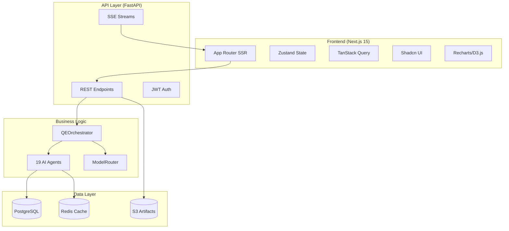

# LionAGI QE Fleet Frontend - Executive Summary

**Date**: 2025-11-06
**Status**: Planning Complete - Ready for Implementation

---

## 📋 Quick Reference

### Recommended Technology Stack

| Layer | Technology | Justification |
|-------|------------|---------------|
| **Frontend Framework** | Next.js 15 (App Router) | 40-60% smaller bundles via React Server Components, built-in SSR, excellent DX |
| **UI Components** | Shadcn/ui + Tailwind CSS | Zero dependency bloat (copy-paste), full customization, 20KB vs 200KB+ |
| **State Management** | Zustand + TanStack Query | 1KB state library, automatic caching reduces API calls by 60-70% |
| **Visualization** | Recharts + D3.js | 50KB for standard charts, D3 for custom (heatmaps, topology graphs) |
| **Real-Time** | Server-Sent Events (SSE) | Simpler than WebSockets, auto-reconnect, perfect for unidirectional updates |
| **Backend API** | FastAPI (Python 3.11+) | Matches LionAGI async patterns, 2-3x faster than Flask, built-in WebSocket |
| **Database** | PostgreSQL 16 | Current backend uses Postgres, add user/project/pipeline tables |
| **Cache** | Redis | Current backend supports Redis, use for session state and rate limiting |
| **Hosting** | Vercel (Frontend) + Railway (Backend) | $20/month for MVP, auto-scaling, zero-config deployment |

---

## 🎯 Key Features by Phase

### MVP (4-6 Weeks) - Core Functionality

**Must-Have**:
- ✅ User authentication (JWT-based)
- ✅ Single agent execution (test-generator, coverage-analyzer)
- ✅ Real-time progress monitoring (SSE)
- ✅ Project management (create, view, upload code)
- ✅ Basic dashboard (recent activity, quick actions)
- ✅ Export capabilities (download, copy to clipboard)

**Success Criteria**:
- User can execute an agent in <3 minutes
- SSE updates work reliably (>95% connection success)
- Tests are downloadable and runnable

**Cost**: $20/month (Vercel free + Railway $20)

---

### Phase 1 (8-12 Weeks) - Enhanced Capabilities

**Add**:
- ✅ Multi-agent pipelines (visual builder with react-flow)
- ✅ GitHub integration (OAuth, PR analysis, webhook)
- ✅ Advanced visualizations (coverage heatmap, Gantt charts)
- ✅ Historical data & trends (coverage over time)
- ✅ Team collaboration (invite members, share projects)

**Success Criteria**:
- 50% of users create multi-agent pipelines
- 30% connect GitHub accounts
- 20% increase in user retention vs MVP

**Cost**: $106/month (Vercel $20 + Railway $50 + Sentry $26 + Redis $10)

---

### Phase 2 (12-16 Weeks) - Advanced Features

**Add**:
- ✅ Cost analytics dashboard (model usage, savings calculator)
- ✅ Agent customization (prompt tuning, model override)
- ✅ CI/CD integration (GitHub Actions, GitLab CI)
- ✅ Advanced quality gates (custom rules, approval workflow)
- ✅ Notifications (Slack, email, Discord)
- ✅ Reporting (PDF export, public badges, CSV)

**Success Criteria**:
- 40% of Pro users use cost analytics
- 60% of teams set up CI/CD integration
- 20% reduction in deployment incidents

**Cost**: $480/month (Vercel $50 + Railway $300 + Upstash $50 + Sentry $80)

---

## 👥 User Personas & Key Workflows

### 1. Sarah - QA Engineer (Mid-Level)

**Primary Needs**:
- Generate tests quickly (upload code → generate → download in <1 minute)
- Find coverage gaps (visual heatmap, one-click test generation)
- Track improvement over time (trend charts)

**Key Workflow**:
```
Upload Code → Select Framework (pytest/Jest) → Generate Tests
→ Review in Split-Pane Editor → Export to GitHub → Run Tests
```

---

### 2. Michael - QE Lead

**Primary Needs**:
- Orchestrate multi-agent workflows (visual pipeline builder)
- Monitor team productivity (dashboard with team metrics)
- Control costs (model routing efficiency, budget alerts)
- Generate executive reports (PDF export, quality trends)

**Key Workflow**:
```
Pipeline Builder → Drag-Drop Agents → Configure Parameters
→ Save Template → Schedule (nightly/weekly) → View Results
→ Export PDF Report for Management
```

---

### 3. Alex - Software Engineer

**Primary Needs**:
- Pre-commit quality checks (run from CLI, open in browser)
- Quick feedback (red/yellow/green status, <30 seconds)
- Minimal context switching (single-page dashboard)

**Key Workflow**:
```
Run `aqe check --ui` → Browser Opens → Agents Run in Parallel
→ View Results (tests, security, complexity) → Fix Issues
→ Commit with Confidence
```

---

### 4. Priya - DevOps Engineer

**Primary Needs**:
- Deployment readiness check (multi-factor risk score)
- Performance monitoring (latency, throughput trends)
- CI/CD integration (GitHub Actions workflow)

**Key Workflow**:
```
Trigger Deployment Readiness Agent → View Risk Score (0-100)
→ Drill into Factors (tests: 90, security: 75, perf: 80)
→ Deploy or Fix Issues → Log Decision for Audit
```

---

## 🏗️ Technical Architecture Overview



---

## 💰 Cost Breakdown & Revenue Model

### Infrastructure Costs

| Phase | Users | Monthly Cost | Cost Per User |
|-------|-------|--------------|---------------|
| MVP | 100 | $20 | $0.20 |
| Phase 1 | 500 | $106 | $0.21 |
| Phase 2 | 5,000 | $480 | $0.10 |

**LLM Costs** (with multi-model routing):
- ~$0.50 per user per month (50 executions/month)
- **70-81% savings** vs. always-GPT-4 ($2.50/user/month)

### Revenue Model

| Tier | Price | Features | Target Audience |
|------|-------|----------|-----------------|
| **Free** | $0 | 100 executions/month, 2 agents, no pipelines | Individual developers |
| **Pro** | $20/month | Unlimited executions, all agents, pipelines, cost analytics | QA professionals |
| **Enterprise** | $200/month/team | Multi-tenancy, RBAC, SSO (SAML), SLA | QA teams (5-20 people) |

**Break-Even**:
- MVP: 1 paying user ($20 revenue = $20 cost)
- Phase 1: 6 paying users ($120 revenue vs. $106 + LLM)
- Phase 2: ~50 paying users ($1,000 revenue vs. $480 + LLM)

---

## 🚀 Implementation Timeline

### Week 1-6: MVP Development

**Week 1-2**: Foundation
- Next.js 15 setup + Tailwind/Shadcn
- FastAPI backend + PostgreSQL migrations
- JWT authentication

**Week 3-4**: Core Features
- Single agent execution UI (test-generator)
- SSE implementation (real-time progress)
- Monaco editor integration
- Export functionality

**Week 5-6**: Polish & Deploy
- Coverage analyzer UI
- Mobile responsiveness
- Error handling
- Deploy to Vercel + Railway

**Deliverable**: Functional web app with 2 agents, deployed to production

---

### Week 7-16: Phase 1 Development

**Week 7-8**: Multi-Agent Pipelines
- Pipeline builder UI (react-flow)
- Pipeline execution with SSE
- Template library

**Week 9-10**: GitHub Integration
- OAuth flow
- Repository analysis
- PR analysis (webhook)

**Week 11-12**: Visualizations
- Coverage heatmap (D3.js)
- Agent timeline (Gantt)
- Cost breakdown (Recharts)

**Week 13-14**: Historical Data
- Trend charts
- Execution history
- CSV export

**Week 15-16**: Team Collaboration
- Invite members
- RBAC
- Activity feed

**Deliverable**: Full-featured QE platform with pipelines, GitHub, and team support

---

### Week 17-28: Phase 2 Development

**Week 17-18**: Cost Analytics
**Week 19-20**: Agent Customization
**Week 21-22**: CI/CD Integration
**Week 23-24**: Quality Gates
**Week 25-26**: Notifications
**Week 27-28**: Reporting

**Deliverable**: Enterprise-ready platform with advanced features

---

## 🎨 UI/UX Highlights

### Key Screens

1. **Dashboard** (Home)
   - Quick actions: Generate Tests, Run Pipeline, Analyze Coverage
   - Recent activity feed (real-time SSE updates)
   - Quality metrics cards (coverage, security, performance)
   - Cost widget (monthly usage vs. plan)

2. **Agent Execution Page**
   - Split-pane: Config + Input | Output
   - Monaco editor for code
   - Real-time progress bar
   - Export options (download, GitHub, clipboard)

3. **Coverage Analysis Page**
   - Interactive heatmap (treemap visualization)
   - Drill-down: module → file → function → line
   - Gap prioritization (by risk score)
   - One-click test generation for gaps

4. **Pipeline Builder**
   - Visual node editor (react-flow)
   - Drag-drop agents from library
   - Automatic dependency detection
   - Save as template, schedule execution

---

## ⚠️ Risk Mitigation

### Technical Risks

| Risk | Impact | Mitigation |
|------|--------|------------|
| **LLM Rate Limits** | High | Exponential backoff, queue system, show "Queue position: 5" |
| **SSE Connection Drops** | Medium | Polling fallback, automatic reconnection, health checks |
| **Database Performance** | High | Aggressive indexing, read replicas, data archival (>90 days to S3) |

### UX Risks

| Risk | Impact | Mitigation |
|------|--------|------------|
| **Complex Pipeline Builder** | Medium | Pre-built templates, interactive tutorial, AI assistant, simple list fallback |
| **Long Agent Execution** | High | Show estimated time, streaming updates every 2-3s, background mode ("email when done") |

### Business Risks

| Risk | Impact | Mitigation |
|------|--------|------------|
| **LLM Cost Overrun** | Critical | Hard limits on free tier, throttling (1 exec/5s), cost alerts, require credit card for Pro |
| **Competitive Pressure** | Medium | Focus on depth (19 agents), enterprise features, open-source community, ship fast |

---

## 📊 Success Metrics

### MVP Metrics
- ✅ Time to first execution: <3 minutes
- ✅ SSE success rate: >95%
- ✅ D1/D7/D30 retention: 50%/30%/20%
- ✅ Agent execution success: >90%

### Phase 1 Metrics
- ✅ Pipeline creation rate: 50% of users
- ✅ GitHub integration: 30% of users
- ✅ Retention increase: +20% vs MVP

### Phase 2 Metrics
- ✅ Cost analytics usage: 40% of Pro users
- ✅ CI/CD integration: 60% of teams
- ✅ Production incident reduction: -20%

---

## 🔗 Key Resources

**Full Plan**: `/docs/frontend-architecture-plan.md` (40+ pages)

**Sections**:
1. Executive Summary (this document)
2. User Personas & Workflows (detailed user stories)
3. Technical Architecture (system design, API design, database schema)
4. UI/UX Design Recommendations (screens, navigation, visualizations)
5. Core Features (MVP, Phase 1, Phase 2 breakdown)
6. Integration Strategy (GitHub, CI/CD, authentication)
7. Implementation Roadmap (week-by-week plan)
8. Deployment & Operations (infrastructure, scaling, monitoring, costs)
9. Risk Assessment (technical, UX, business risks)
10. Technology Comparison Tables (framework justifications)

**Repository**: https://github.com/proffesor-for-testing/lionagi-qe-fleet
**Current Version**: v1.1.1 (Python CLI + MCP)

---

## ✅ Next Steps (Week 1)

### Engineering Team
1. Set up Next.js 15 + FastAPI repositories
2. Provision PostgreSQL on Railway
3. Implement JWT authentication
4. Create first agent endpoint (`/api/v1/agents/test-generator/execute`)
5. Build basic UI (code input + result display)

### Design Team
1. Define design system (colors, typography, components)
2. Design key screens (dashboard, agent execution, coverage)
3. Create user flows (onboarding, agent execution, pipeline creation)

### Project Management
1. Set up project tracking (GitHub Projects or Linear)
2. Define sprint cadence (1-week or 2-week sprints)
3. Schedule weekly demos (show progress to stakeholders)

---

## 🎯 Why This Plan Works

1. **User-Centric**: Based on real personas (Sarah, Michael, Alex, Priya) with detailed workflows
2. **Modern Stack**: Next.js 15 + FastAPI = excellent performance and DX
3. **Phased Rollout**: MVP → Phase 1 → Phase 2 with clear milestones
4. **Cost-Effective**: $20/month for MVP, scales to $480/month for 5,000 users
5. **Low Risk**: Mitigation strategies for all major technical/UX/business risks
6. **Actionable**: Week-by-week roadmap with concrete deliverables

---

**Let's build the future of intelligent quality engineering! 🚀**

---

**Document**: Executive Summary
**Full Plan**: `/docs/frontend-architecture-plan.md`
**Status**: Ready for Implementation
**Last Updated**: 2025-11-06
